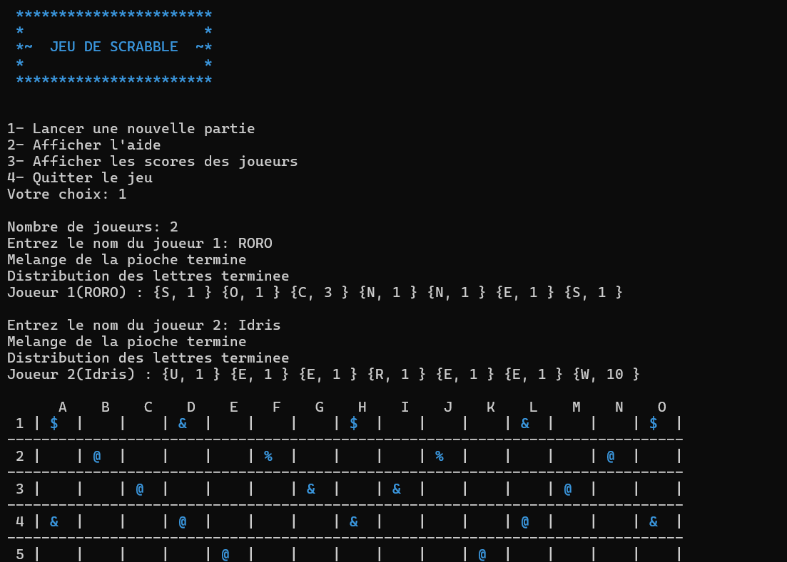

# Scrabble

Scrabble is a classic board game in which players form words by placing letters on a 15x15 square board. 

Each player picks a number of letters at random, and each letter has a point value.

The objective is to form words using the letters on the board and collect as many points as possible.

